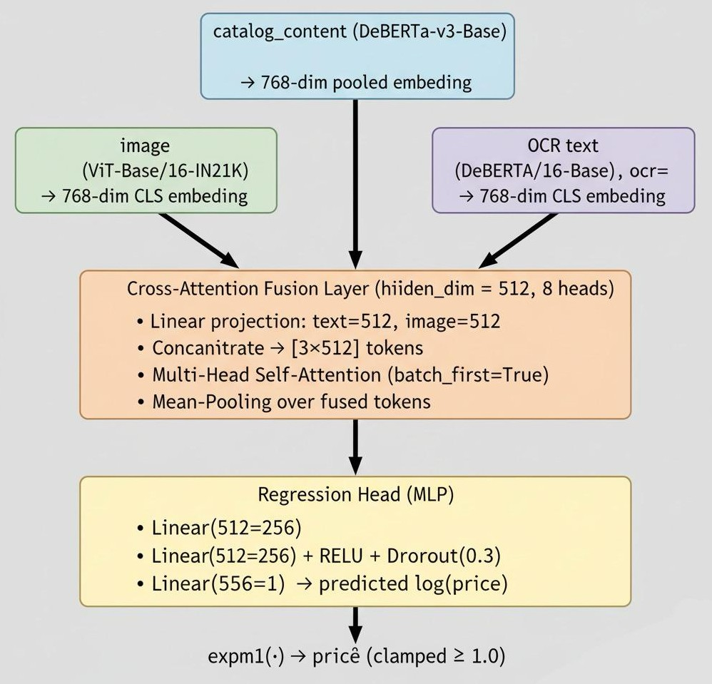

# ML Challenge 2025: Smart Product Pricing Solution Template

**Team Name:** Singularity  
**Team Members:** Harsh Raj, Hammad Khan, Rakesh Kumar Giri  
**Submission Date:** 12-10-2025

---

## 1. Executive Summary
Our solution predicts optimal product prices by integrating **textual, visual, and OCR-extracted signals** in a unified deep multimodal architecture. We combine a **DeBERTa-v3 Base** text encoder, a **ViT-Base/16-IN21K** image encoder, and a separate **OCR-text DeBERTa-v3 encoder**, fused via a cross-attention regression head. This approach leverages rich semantics from product descriptions and embedded image text (e.g., brand names, quantity, variant) for robust price estimation.

---

## 2. Methodology Overview

### 2.1 Problem Analysis
Product pricing depends on both **visual cues** (e.g., packaging type, premium branding) and **linguistic cues** (e.g., “pack of 3”, “organic”, “500 ml”). We observed during EDA that text fields often omit information visible on the image (brand logo, quantity labels). Hence, we introduced an OCR stage to extract and model these missing signals.

**Key Observations:**
- Product titles often contain brand and quantity but vary heavily in format.
- Images provide complementary brand/variant information not always in text.
- Price distribution is right-skewed → handled using log-price regression.

### 2.2 Solution Strategy

**Approach Type:** Multimodal Deep Learning (Text + Image + OCR)  
**Core Innovation:** OCR-guided Tri-Modal Fusion Network with Cross-Attention

We fine-tune large pretrained transformers on the combined dataset, optimizing a regression objective on log-scaled prices. Inference converts predicted log-prices via expm1() and clips results to ensure positive outputs.

---

## 3. Model Architecture

### 3.1 Architecture Overview

### 3.2 Model Components

**Text Processing Pipeline:**
- [ ] **Preprocessing**: lowercasing, punctuation removal, whitespace normalization
- [ ] **Tokenizer**: microsoft/deberta-v3-base (max_len = 256)
- [ ] **Representation**: [CLS] embedding from final hidden state

**OCR Text Pipeline**
- [ ] **OCR Engines**: PaddleOCR (preferred) → EasyOCR (fallback)
- [ ] **Text Clean-up**: non-alphanumeric filtering, whitespace normalization
- [ ] **Encoder**: second DeBERTa-v3 instance (shared vocabulary)

**Image Processing Pipeline:**
- [ ] **Preprocessing**: resize 224×224, normalization with ImageNet mean/std
- [ ] **Model**: google/vit-base-patch16-224-in21k
- [ ] **Output**: pooled feature (768-dim)

**Fusion Module**
- [ ] Dual linear projections → cross-attention (8 heads) → 2-layer MLP (512 → 256 → 1)

---

## 4. Model Performance

### 4.1 Validation Results
| Metric | Value |
|--------|-------|
|**SMAPE**	|≈ 0.44 – 0.46 (Val) |
|**MAE / RMSE**	|Not officially scored, but monitored for stability |
|**Price Range Coverage**	| 1 – 10 000 + INR (clipped) |

Trained for 12–15 epochs using **AdamW**, cosine warm-up schedule, mixed precision (torch.amp), and **EMA** weight averaging. Gradient checkpointing was enabled for initial training, then disabled for resumed runs to ensure stable backward passes.

## 5. Feature Engineering
- **Log-Price Transformation:** Stabilizes regression and reduces skew.
- **OCR Text Augmentation:** Adds missing brand/quantity info directly from images.
- **Data Cleaning:** Fallback white image for missing links; empty string for missing OCR.
- **Text Fusion:** Concatenated catalog and OCR streams merged via cross-attention.
- **EMA + Warmup:** Smooths convergence, mitigates early overfitting.

## 6. Conclusion
Our tri-modal transformer pipeline demonstrates that combining **semantic** **text**, **visual perception**, and **OCR-extracted brand cues** yields strong generalization for price prediction. This design is robust to missing or noisy data and achieved competitive validation SMAPE (~0.45). The approach is fully reproducible with public pretrained models (DeBERTa + ViT) and open-source OCR engines.

---

<!-- ## Appendix

### A. Code artefacts
*Include drive link for your complete code directory*

### B. Additional Results
*Include any additional charts, graphs, or detailed results*

---

**Note:** This is a suggested template structure. Teams can modify and adapt the sections according to their specific solution approach while maintaining clarity and technical depth. Focus on highlighting the most important aspects of your solution. -->